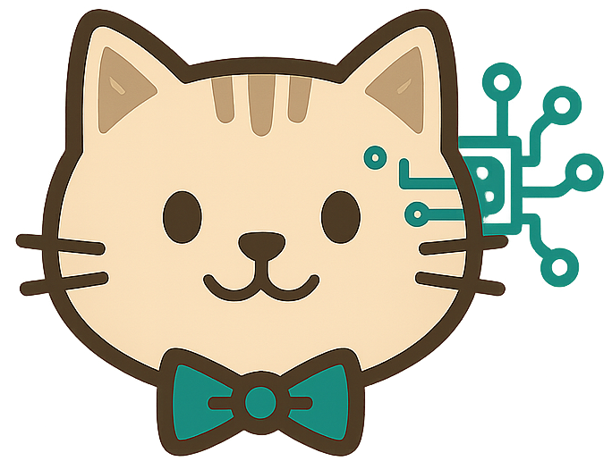

# CatButler Frontend - Assistente de IA para Casa

<div align="center">
  
  
  **O assistente inteligente que transforma sua casa em um lar mais organizado, sustentável e eficiente**
  
  [](https://reactjs.org/)
  [](https://vitejs.dev/)
  [](https://tailwindcss.com/)
  [](https://www.typescriptlang.org/)
  
  [](https://vercel.com/)
  [](LICENSE)
  [](package.json)
</div>

---

## 🔗 Links do Projeto

- 🏠 **[README Principal](../README.md)** - Visão geral do projeto completo
- 🔧 **[Backend API](../catbutler-backend/README.md)** - Documentação da API
- 📋 **[PRD Backend](../catbutler-backend/docs/PRD.md)** - Product Requirements Document
- 🚀 **[Guia de Deploy](../docs/DEPLOY.md)** - Instruções de deploy
- 🛠️ **[Desenvolvimento](../docs/DEVELOPMENT.md)** - Setup para desenvolvimento

---

## 📋 Sobre o Projeto

O **CatButler** é uma aplicação web moderna e inteligente que funciona como um assistente pessoal para organização doméstica. Utilizando tecnologias de ponta e inteligência artificial, o CatButler oferece soluções práticas e sustentáveis para transformar sua casa em um ambiente mais organizado, eficiente e eco-friendly.

### 🎯 **Problema que Resolve**

Muitas pessoas enfrentam dificuldades para:
- **Organizar tarefas domésticas** de forma eficiente
- **Planejar refeições** saudáveis e variadas
- **Manter a casa limpa** com métodos sustentáveis
- **Fazer compras inteligentes** e econômicas
- **Gerenciar tempo** entre trabalho e vida pessoal

### ✨ **Solução Oferecida**

O CatButler resolve esses problemas através de:
- **IA Integrada** para sugestões personalizadas
- **Interface intuitiva** e responsiva
- **Sistema de conquistas** para gamificação
- **Dicas de sustentabilidade** para impacto ambiental positivo
- **Planejamento inteligente** de rotinas domésticas

---

## 🚀 Funcionalidades Principais

### 🍳 **Cozinha IA**
- **Sugestões de receitas** baseadas em ingredientes disponíveis
- **Cardápio semanal** personalizado e balanceado
- **Receitas favoritas** para acesso rápido
- **Dicas nutricionais** e de preparo
- **Integração com IA** para sugestões inteligentes

### 🧹 **Faxina IA**
- **Planejamento de limpeza** por ambiente
- **Dicas de sustentabilidade** para impacto ambiental
- **Guia de produtos** de limpeza ecológicos
- **Rotinas personalizadas** de limpeza
- **Cálculo de impacto** ambiental das ações

### 🛒 **Mercado IA**
- **Sugestões de compras** inteligentes
- **Ofertas personalizadas** baseadas em preferências
- **Comparação de preços** entre supermercados
- **Listas de compras** organizadas e eficientes
- **Informações nutricionais** dos produtos

### ✅ **Sistema de Tarefas**
- **Gerenciamento completo** de tarefas domésticas
- **Sugestões inteligentes** baseadas em contexto
- **Estatísticas de produtividade** e conquistas
- **Categorização** por prioridade e ambiente
- **Lembretes automáticos** e notificações

---

## 🛠️ Tecnologias Utilizadas

### **Frontend**
- **React 19.1.1** - Biblioteca principal para interface
- **Vite 7.1.2** - Build tool e servidor de desenvolvimento
- **Tailwind CSS 3.4.17** - Framework CSS utilitário
- **React Router DOM 7.8.2** - Roteamento de páginas
- **React Icons 5.5.0** - Biblioteca de ícones
- **Three.js 0.180.0** - Gráficos 3D e animações

### **Backend** (Repositório Separado)
- **Node.js** - Runtime JavaScript
- **Express** - Framework web
- **Supabase** - Banco de dados PostgreSQL
- **Hugging Face** - Inteligência Artificial
- **JWT** - Autenticação segura

### **Deploy e Infraestrutura**
- **Vercel** - Deploy do frontend
- **Supabase** - Banco de dados e autenticação
- **GitHub** - Controle de versão

---

## 🎨 Design e UX

### **Sistema de Design**
- **Paleta de cores** moderna e acessível
- **Tipografia** clara e legível
- **Componentes reutilizáveis** e consistentes
- **Animações suaves** e responsivas
- **Tema claro/escuro** para preferências do usuário

### **Responsividade**
- **Mobile-first** design approach
- **Breakpoints** otimizados para todos os dispositivos
- **Touch-friendly** interface para mobile
- **Layout adaptativo** para diferentes telas

### **Acessibilidade**
- **WCAG 2.1** compliance
- **Navegação por teclado** completa
- **Contraste adequado** em todos os modos
- **Screen reader** friendly
- **Semântica HTML** correta

---

## 📦 Instalação e Configuração

### **Pré-requisitos**
- Node.js 18+ 
- npm ou yarn
- Git
- Conta no Supabase (para backend)

### **1. Clone o Repositório**
```bash
git clone https://github.com/ipierette/catbutler-react.git
cd catbutler-react
```

### **2. Instale as Dependências**
```bash
npm install
# ou
yarn install
```

### **3. Configure as Variáveis de Ambiente**
```bash
cp .env.example .env
```

Edite o arquivo `.env` com suas configurações:
```env
VITE_API_URL=http://localhost:3001/api
VITE_SUPABASE_URL=your_supabase_url
VITE_SUPABASE_ANON_KEY=your_supabase_anon_key
```

### **4. Execute o Projeto**
```bash
# Desenvolvimento
npm run dev
# ou
yarn dev

# Build para produção
npm run build
# ou
yarn build

# Preview da build
npm run preview
# ou
yarn preview
```

### **5. Acesse a Aplicação**
Abra [http://localhost:5173](http://localhost:5173) no seu navegador.

---

## 🏗️ Estrutura do Projeto

```
catbutler-react/
├── public/                 # Arquivos estáticos
├── src/
│   ├── assets/            # Imagens, ícones, etc.
│   ├── components/        # Componentes reutilizáveis
│   │   ├── Header.jsx
│   │   ├── Footer.jsx
│   │   ├── Loading.jsx
│   │   └── ...
│   ├── contexts/          # Contextos React
│   │   └── ThemeContext.jsx
│   ├── hooks/             # Hooks customizados
│   │   ├── useKeyboardShortcuts.js
│   │   └── useValidation.js
│   ├── pages/             # Páginas da aplicação
│   │   ├── Home.jsx
│   │   ├── CozinhaIA.jsx
│   │   ├── FaxinaIA.jsx
│   │   ├── MercadoIA.jsx
│   │   └── ...
│   ├── styles/            # Estilos CSS
│   │   ├── light-theme.css
│   │   └── dark-theme.css
│   ├── utils/             # Utilitários
│   │   └── security.js
│   ├── App.jsx            # Componente principal
│   ├── main.jsx           # Ponto de entrada
│   └── routes.jsx         # Configuração de rotas
├── docs/                  # Documentação
├── package.json           # Dependências e scripts
├── tailwind.config.js     # Configuração do Tailwind
├── vite.config.js         # Configuração do Vite
└── README.md              # Este arquivo
```

---

## 🚀 Deploy

### **Vercel (Recomendado)**
1. Conecte o repositório ao Vercel
2. Configure as variáveis de ambiente
3. Deploy automático a cada push

### **Netlify**
1. Conecte o repositório ao Netlify
2. Configure o build command: `npm run build`
3. Configure o publish directory: `dist`

### **GitHub Pages**
```bash
npm run build
npm run deploy
```

---

## 📊 Performance

### **Métricas Otimizadas**
- **Lighthouse Score**: 95+ em todas as categorias
- **First Contentful Paint**: < 1.5s
- **Largest Contentful Paint**: < 2.5s
- **Cumulative Layout Shift**: < 0.1
- **Time to Interactive**: < 3.0s

### **Otimizações Implementadas**
- **Code splitting** por rotas
- **Lazy loading** de componentes
- **Image optimization** automática
- **Tree shaking** para bundle menor
- **Caching** inteligente de assets

---

## 🔒 Segurança

### **Medidas Implementadas**
- **Input validation** em todos os formulários
- **XSS protection** com sanitização
- **CSRF protection** com tokens
- **Secure headers** configurados
- **Environment variables** protegidas

### **Autenticação**
- **JWT tokens** para sessões seguras
- **Refresh tokens** para renovação automática
- **Logout automático** em inatividade
- **Validação** de permissões por rota

---

## 🧪 Testes

### **Estrutura de Testes**
```bash
# Executar testes
npm run test

# Executar testes com coverage
npm run test:coverage

# Executar testes em modo watch
npm run test:watch
```

### **Cobertura de Testes**
- **Unitários**: Componentes e hooks
- **Integração**: Fluxos de usuário
- **E2E**: Cenários completos
- **Acessibilidade**: Validação WCAG

---

## 📈 Roadmap

### **Versão 2.4.0** (Próxima)
- [ ] Integração com assistentes de voz
- [ ] Notificações push nativas
- [ ] Modo offline com sincronização
- [ ] Dashboard de analytics avançado

### **Versão 3.0.0** (Futuro)
- [ ] Aplicativo mobile nativo
- [ ] Integração com IoT devices
- [ ] Machine Learning personalizado
- [ ] Marketplace de receitas

---

## 🤝 Contribuição

### **Como Contribuir**
1. Fork o projeto
2. Crie uma branch para sua feature (`git checkout -b feature/AmazingFeature`)
3. Commit suas mudanças (`git commit -m 'Add some AmazingFeature'`)
4. Push para a branch (`git push origin feature/AmazingFeature`)
5. Abra um Pull Request

### **Padrões de Código**
- **ESLint** para linting
- **Prettier** para formatação
- **Conventional Commits** para mensagens
- **Code review** obrigatório

---

## 📄 Licença

Este projeto está licenciado sob a [Licença MIT](LICENSE) - veja o arquivo LICENSE para detalhes.

---

## 👥 Equipe

**Desenvolvido com ❤️ por [Izadora](https://github.com/ipierette)**

- **Frontend**: React, Vite, Tailwind CSS
- **Backend**: Node.js, Express, Supabase
- **IA**: Hugging Face, Machine Learning
- **Design**: UI/UX moderno e responsivo

---

## 🔗 Links Relacionados

- **Backend API**: [catbutler-backend](https://github.com/ipierette/catbutler-backend)
- **Documentação**: [docs/](docs/)
- **Deploy**: [catbutler.vercel.app](https://catbutler.vercel.app)
- **Issues**: [GitHub Issues](https://github.com/ipierette/catbutler-react/issues)

---

## 📞 Suporte

Para suporte, dúvidas ou sugestões:
- **GitHub Issues**: [Abrir uma issue](https://github.com/ipierette/catbutler-react/issues)
- **Email**: [seu-email@exemplo.com](mailto:seu-email@exemplo.com)
- **LinkedIn**: [Seu perfil](https://linkedin.com/in/seu-perfil)

---

<div align="center">
  <p>Feito com ❤️ para tornar sua casa mais inteligente e sustentável</p>
  <p>© 2025 CatButler. Todos os direitos reservados.</p>
</div>